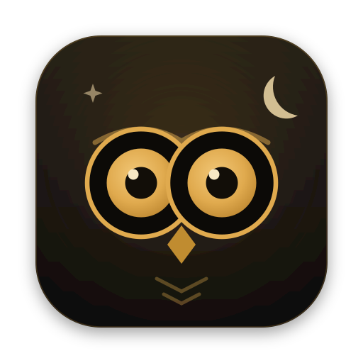

<div align="center">



# Noctua

**AI-first mail client for macOS** — the owl sorts, you decide.

[](https://github.com/Schereo/noctua/actions/workflows/ci.yml)
[](CHANGELOG.md)
[](#getting-started)
[](LICENSE)

</div>

Incoming mail is processed locally and categorized, prioritized, and
summarized by an LLM; the AI drafts replies in your voice — **sending is
always up to you**. Local-first: your mail, index, and keys stay on your
machine.

> A personal project, built for my own use and as an experiment in how far
> "AI-first" can carry a mail client. Tested on macOS (Apple Silicon). No
> warranty — issues and PRs are welcome.

## What Noctua does

- **Triage**: category, priority (1–5), and a one-line summary per thread;
  a "needs you" filter for what matters, spam stays out of the way
- **Tasks from mail**: the owl suggests tasks with due dates — accept or
  dismiss them, manual tasks work too
- **Dictate replies** (⌘D): speak bullet points, the AI writes a draft in
  the style of your previous replies (learned per account)
- **Waiting radar**: detects threads where you're waiting on a reply and
  drafts follow-up nudges — nothing is sent without your go-ahead
- **Search & ask**: hybrid search (full-text + semantic, local via FTS5 +
  sqlite-vec); the owl answers questions about your mailbox with sources
- **Keyboard-first**: j/k, folder tabs, palette (⌘K), undo (z) — the mouse
  is optional
- **Letterpress UI**: calm paper-like design, German and English

## Accounts

| Provider              | Connection                | Auth                                      |
| --------------------- | ------------------------- | ----------------------------------------- |
| Gmail                 | IMAP/SMTP                 | OAuth2 (Google login in browser, XOAUTH2) |
| Outlook.com / Hotmail | IMAP/SMTP                 | OAuth2 (msal-node, XOAUTH2)               |
| Proton                | Proton Bridge (localhost) | bridge password, TLS on loopback          |
| Any                   | IMAP/SMTP                 | password/app password                     |

For Google and Microsoft, Thunderbird's public client IDs are the default
(common practice among open-source mail clients — there is no real "secret"
in installed-app OAuth). You can use your own clients via settings
(`google.clientId`/`google.clientSecret`, `ms.clientId`).

## AI & privacy

AI runs through [OpenRouter](https://openrouter.ai) — **bring your own key**,
entered in Settings → Intelligence and stored in the macOS keychain
(safeStorage). A cheap model handles triage, a strong one drafts replies;
both model IDs are configurable.

The only thing that leaves your machine is mail text for triage, drafts, and
questions (sent directly to OpenRouter, no middle server). Without a key,
Noctua keeps working as a regular mail client — the owl just sleeps.
Embeddings for semantic search are computed locally (transformers.js), and
remote images in mail are blocked behind a per-sender allowlist.

## Getting started

Requirements: macOS, [Node.js](https://nodejs.org) ≥ 22,
[pnpm](https://pnpm.io) ≥ 9.

```bash
git clone https://github.com/Schereo/noctua.git
cd noctua
pnpm install        # dependencies + native rebuild (better-sqlite3)
pnpm dev            # run the app in dev mode (HMR)
```

Then, inside the app: connect an account (Settings → Accounts) and add your
OpenRouter key (Settings → Intelligence) — that's it.

```bash
pnpm typecheck      # TypeScript checks
pnpm test           # test suite (Vitest)
pnpm coverage       # test suite with coverage report
pnpm build:unpack   # production build without DMG
pnpm build:mac      # build the DMG
```

The DMG is not signed/notarized (no Apple developer account). On first
launch on another Mac: right-click → Open, or
`xattr -d com.apple.quarantine /Applications/Noctua.app`.

**Dev vs. prod data:** dev mode uses its own data directory
(`~/Library/Application Support/noctua`), the packaged app a separate one
(`noctua-prod`) — both can run side by side. On macOS, `pnpm dev` launches a
branded Electron shell and signals the main process with `NOCTUA_DEV=1` that
it is in dev mode despite `app.isPackaged`.

## Tests

Vitest covers the correctness-critical core: threading (subject
normalization, JWZ-light), MIME parsing, ingest incl. Gmail dedupe, FTS
search, rule matching, budget math, outbox/undo-send, the IPC contract, and
all migrations (in-memory DB). Electron is mocked in `test/setup.ts`.

**better-sqlite3 ABI:** the native module is ABI-bound — the app runs under
Electron's Node, tests under system Node. `pnpm test` automatically rebuilds
it for Node, runs the tests, and restores the Electron build afterwards. If
a test run dies hard, `pnpm run rebuild:electron` repairs the app build.

CI (`.github/workflows/ci.yml`) runs typecheck + tests on every push and PR.

## Architecture

- **Main process**: IMAP sync (imapflow, IDLE + polling), SQLite with FTS5
  and sqlite-vec (better-sqlite3), AI queue (OpenRouter), credentials in a
  safeStorage vault, SMTP (nodemailer) with outbox and undo window
- **Renderer**: React 19, sandboxed with no Node access; data flows
  exclusively through the typed IPC contract (`src/shared/ipc-contract.ts`,
  zod-validated)
- **Updates**: the app checks GitHub releases and shows a notice with a
  download link — no automatic installs

## Known limits

- macOS-only (window chrome, keychain, and dev tooling are built around it);
  tested on Apple Silicon
- Attachments currently fetch the full mail source; BODYSTRUCTURE part
  downloads are the documented optimization point
- No POP3, no CalDAV/CardDAV — Noctua is a mail client

## License

[MIT](LICENSE)
